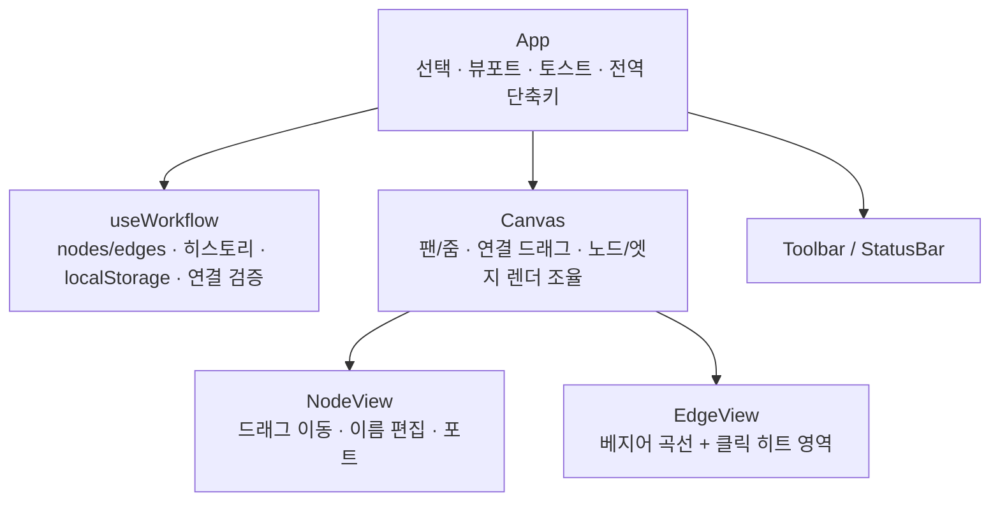
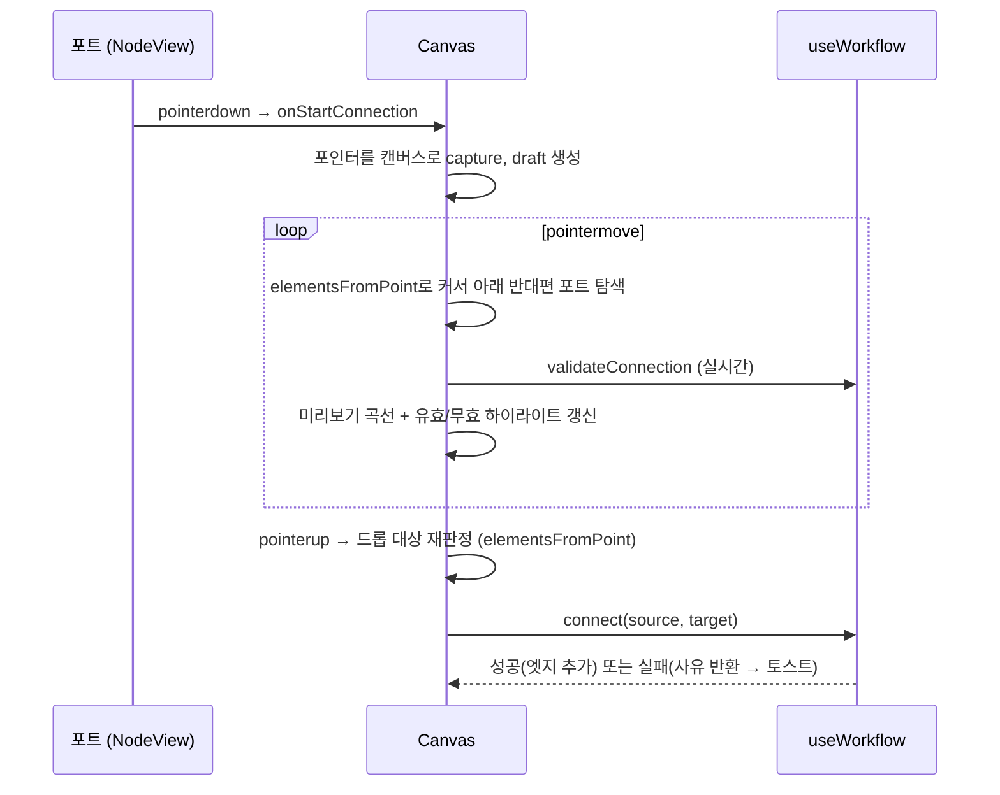

# 구현 해설 (Architecture)

이 문서는 Workflow Editor의 내부 구조와 핵심 구현 판단을 설명합니다.
README의 [기술적 의사결정](../README.md#기술적-의사결정)을 더 깊게 풀어쓴 문서입니다.

## 1. 전체 구조



### 상태 소유권 — "상태는 그것을 쓰는 가장 가까운 곳에"

| 상태 | 위치 | 이유 |
| --- | --- | --- |
| 그래프(nodes/edges) + 히스토리 | `useWorkflow` (useReducer) | 도메인 핵심. 액션 단위로 undo 경계를 정의 |
| 선택(selection) | `App` (useState) | 툴바 버튼 활성화 · 캔버스 하이라이트 · 단축키가 함께 사용 |
| 뷰포트(pan/zoom) | `App` (useState) | 캔버스 조작과 툴바 줌 컨트롤 · fit view가 공유 |
| 연결 드래프트(draft) | `Canvas` (useState) | 캔버스 내부에서만 쓰이는 일시적 상호작용 상태 |
| 팬 진행 정보 | `Canvas` (useRef) | 렌더에 영향 없는 드래그 임시값 → 리렌더 발생 안 함 |
| 이름 편집 중 여부 | `NodeView` (useState) | 개별 노드의 로컬 UI 상태 |

선택 상태는 한 가지 파생 처리가 있습니다. 삭제나 undo로 선택 대상이 사라질 수 있는데,
effect에서 `setSelection(null)`로 동기화하는 대신 `effectiveSelection`이라는 **파생 값**(useMemo)으로
"존재하지 않으면 선택 없음"을 계산합니다. effect에서 setState를 부르는 안티패턴(연쇄 렌더)을
피하는 방식이며, `react-hooks` v7의 `set-state-in-effect` 규칙도 이를 강제합니다.

## 2. 좌표계

두 좌표계를 명확히 분리합니다.

- **월드 좌표**: 노드가 저장되는 논리 좌표. 줌/팬과 무관.
- **화면 좌표**: 실제 픽셀. `화면 = 월드 × zoom + pan`

```
screenToWorld(client) = (client - canvasOrigin - pan) / zoom
```

### 노드 드래그 보정

드래그는 화면 픽셀 단위로 일어나므로, 월드 좌표로 환산할 때 `zoom`으로 나눕니다.

```
새 위치 = 드래그 시작 위치 + (화면 이동량 / zoom)
```

시작 위치를 기준으로 누적 계산하기 때문에(증분 방식이 아님) 이벤트가 일부 유실돼도 오차가 쌓이지 않습니다.

### 줌-투-커서

휠 줌 시 "커서 아래에 있던 월드 지점"이 줌 후에도 같은 화면 위치에 있어야 자연스럽습니다.

```
줌 전: world = (cursor - pan) / zoom
줌 후에도 같아야 하므로: cursor = world × zoom' + pan'
→ pan' = cursor - (cursor - pan) × (zoom' / zoom)
```

`Math.exp(-deltaY × 0.0015)`를 배율로 사용해 휠 방향과 무관하게 부드럽게 연속되도록 했습니다
(지수 스케일은 확대/축소가 대칭이 됩니다).

## 3. 렌더링 구조

```html
<div class="canvas">                    <!-- 배경 그리드, 이벤트 수신 -->
  <div class="canvas-world"             <!-- transform: translate(pan) scale(zoom) -->
       style="transform: ...">
    <svg class="edge-layer">…</svg>     <!-- 엣지 (노드와 같은 좌표계) -->
    <div class="node" style="transform: translate(x, y)">…</div>
  </div>
</div>
```

- 팬/줌은 `canvas-world` 컨테이너의 **CSS transform 하나**로 처리합니다. 노드·엣지가 각자 좌표를
  다시 계산할 필요가 없고, transform은 리플로우 없이 컴포지터에서 처리되어 저렴합니다.
- SVG는 `width/height`를 사실상 0으로 두고 `overflow: visible`로 그립니다. 컨테이너와 좌표 원점을
  공유하므로 노드 위치 = 엣지 끝점 계산이 단순한 산수가 됩니다.
- 배경 도트 그리드는 `background-size: GRID×zoom`, `background-position: pan`으로 동기화해
  실제로 함께 움직이는 것처럼 보입니다.
- 엣지 화살표는 SVG `marker`로 그리며, 화살촉이 포트 원 아래에 가려지지 않도록 엣지의 시작/끝
  앵커를 포트 중심에서 몇 px 안쪽으로 이동합니다(`edgeAnchor`).
- 엣지 선택 편의를 위해 보이는 선(2px)과 별개로 투명한 14px `edge-hit` 패스를 겹칩니다.

## 4. 연결 드래그 흐름



설계 포인트:

- **포인터 캡처를 캔버스로 이전** — 드래그 시작은 포트에서 하지만 `setPointerCapture`를 캔버스
  요소에 걸어, 이후의 move/up을 캔버스가 일관되게 수신합니다. 커서가 창 밖으로 나가도 유지됩니다.
- **드롭 판정은 `pointerup` 시점에 재계산** — move 중 저장해 둔 hover 상태를 신뢰하지 않고,
  놓는 순간의 커서 위치에서 `elementsFromPoint`로 다시 찾습니다. React는 이벤트 종류에 따라
  상태 커밋 우선순위가 다르므로(pointermove는 continuous 우선순위), "마지막 move의 상태가
  up 시점에 반드시 커밋되어 있다"에 기대지 않기 위함입니다. 이 방식은 렌더 타이밍과 무관하게 정확합니다.
- **방향 정규화** — 드래그는 출력 포트에서든 입력 포트에서든 시작할 수 있지만, 결과 엣지는 항상
  `source(출력) → target(입력)`으로 정규화됩니다(`resolveDirection`).
- **후보 하이라이트** — draft가 있는 동안 반대편 포트들에 펄스 애니메이션을, 커서가 올라간 포트에는
  검증 결과에 따라 초록/빨강 링을 표시합니다. 판정 로직(`findHoverTarget`)은 move의 하이라이트와
  up의 확정이 동일한 함수를 사용해 "보이는 것과 실제 동작"이 일치합니다.

## 5. 히스토리 (Undo/Redo)

```ts
interface HistoryState {
  past: GraphState[]      // 이전 스냅숏 (최대 50)
  present: GraphState     // 현재
  future: GraphState[]    // redo 대상
  moveSnapshot: GraphState | null  // 드래그 시작 시점 스냅숏
}
```

- 추가/삭제/연결/이름 변경은 `pushHistory`로 present를 past에 밀어 넣고 future를 비웁니다.
- **드래그 이동은 특별 취급**: 60fps로 발생하는 `MOVE_NODE`를 전부 기록하면 undo가 1px 단위로
  쪼개집니다. `BEGIN_MOVE`에서 시작 스냅숏만 저장하고, `END_MOVE`에서 그 스냅숏을 past에 1회
  기록합니다. 스냅숏을 컴포넌트 ref가 아니라 **리듀서 상태 안에** 두어, 기록 로직이 리듀서 내부에서
  원자적으로 완결됩니다.
- 상태는 불변 업데이트만 사용하므로 스냅숏 간에 변경되지 않은 노드/엣지 객체는 참조를 공유합니다.
  50개 제한과 함께 메모리 부담이 사실상 없습니다.

## 6. 연결 검증 규칙

`validateConnection(source, target)`이 순서대로 검사합니다.

1. 두 노드가 존재하는가
2. 자기 자신 연결이 아닌가 (UI에서도 같은 노드 포트는 후보에서 제외 — 이중 방어)
3. source에 출력 포트, target에 입력 포트가 있는 타입인가
4. 동일한 `source → target` 엣지가 이미 있는가
5. **사이클이 생기지 않는가** — `source → target`을 추가했을 때 사이클이 생기는 조건은
   "기존 그래프에서 target으로부터 source에 도달 가능"이므로, target에서 시작하는 DFS로
   source 도달 여부를 검사합니다. 복잡도 O(V + E).

실패 시 사유 문자열을 반환하고, UI는 토스트로 그대로 안내합니다. 규칙 전체가 순수 함수라
단위 테스트를 붙이기 쉬운 구조입니다.

## 7. 영속화

- present가 바뀔 때마다 300ms 디바운스로 `localStorage`에 저장 — 드래그 중 매 프레임 쓰기를 방지합니다.
- `beforeunload`에서 즉시 flush해 마지막 변경 유실을 막습니다.
- 로드 시 타입 가드(`isNode`/`isEdge`)로 스키마를 검증하고, 존재하지 않는 노드를 가리키는
  엣지(dangling edge)를 걸러냅니다. JSON 파싱 실패 등 손상 시 빈 캔버스로 대체합니다.

## 8. 성능 고려

- `NodeView`/`EdgeView`는 `memo` — 노드 하나를 드래그할 때 나머지 노드는 리렌더되지 않습니다.
- 팬은 ref + transform만 갱신, 연결 드래그 중 검증은 O(V+E) DFS로 수십 노드 규모에서 무시 가능한 비용입니다.
- 수백~수천 노드 규모로 간다면: 뷰포트 밖 노드 컬링(가상화), 노드별 핸들러 대신 캔버스 이벤트
  델리게이션, move 이벤트 rAF 스로틀이 다음 단계입니다.

## 9. 한계와 확장 아이디어

- 멀티 선택(shift 클릭 · 마퀴 드래그)과 그룹 이동
- 노드 더블클릭 시 파라미터 편집 패널 (노드 타입별 설정)
- 위상 정렬 기반 "실행" 시뮬레이션 (DAG이 보장되므로 바로 가능)
- 미니맵, 스냅 투 그리드, 엣지 라벨
- `utils/graph.ts` 순수 함수(사이클 검사, 좌표 변환)에 대한 Vitest 단위 테스트

## 부록 — 코드 읽는 순서 추천

1. [types.ts](../src/types.ts) — 도메인 언어 파악
2. [constants.ts](../src/constants.ts) — 노드 타입/크기 설정
3. [utils/graph.ts](../src/utils/graph.ts) — 좌표·경로·사이클 순수 함수
4. [hooks/useWorkflow.ts](../src/hooks/useWorkflow.ts) — 리듀서와 히스토리
5. [components/Canvas.tsx](../src/components/Canvas.tsx) — 팬/줌과 연결 드래그
6. [components/NodeView.tsx](../src/components/NodeView.tsx) — 노드 드래그와 편집
7. [App.tsx](../src/App.tsx) — 조합과 전역 동작
